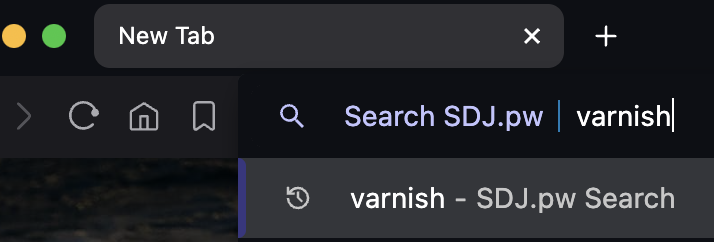

# 🚧 This repo is archived

This project has moved to my main website.
This repository is read-only and kept for historical reference.

👉 **New Home:** https://www.samdjames.uk/docs/

👉 **New Code:** https://github.com/samjuk/samdjames.uk


# DOCS.SDJ.PW
The goal of this platform is provide an centralised knowledge base, primarily for my self and colleagues. Although I am sure, some of this will be useful to the wider community.

- Hosted over at [https://docs.sdj.pw](https://docs.sdj.pw/?utm_source=github&utm_medium=repository&utm_campaign=sdj_pw)
- Built with [VitePress](https://vitepress.dev/)


## Configuring as a Custom Search Engine
Custom Search Engines are where you enter a set keyphrase into the omnibar followed by a tab, and it will search directly that site. For example, I configure `sdj` as the phrase, so if i enter `sdj<tab>varnish`. It will navigate me directly to the search page of this site displaying varnish content.

- [Chrome Guidance](https://support.google.com/chrome/answer/95426?hl=en-GB&co=GENIE.Platform%3DDesktop)
- [FireFox Guidance](https://support.mozilla.org/en-US/kb/add-or-remove-search-engine-firefox#:~:text=Search%20engine%20add%2Dons,-Many%20providers%20offer&text=Change%20search%20settings%20icon.,and%20click%20Add%20to%20Firefox.)



## Local Development
1. Clone the repository
```sh
git clone https://github.com/samjuk/docs.sdj.pw . && cd docs.sdj.pw/
```

2. Install the requirements
```sh
npm ci
```

3. Start the local development server
```sh
make dev
```

4. View at http://localhost:5173

## Building Production
Production build and deployment is taken care of by CI (Github Actions). The following variables need to be set on the project.

Type | Name | Description
--- | --- | ---
SECRET | `SSH_PRIVATE_KEY` | SSH Private key that is authorised to connect to the remote host
SECRET | `SSH_KNOWN_HOSTS` | Known host entry for the remote host
SECRET | `REMOTE_HOST` | Username & Host for the remote host
SECRET | `REMOTE_PATH` | Absolute Path to the web root on the remote host
SECRET | `CLOUDFLARE_CACHE_ZONE` | Cache Zone to flush during deployments
SECRET | `CLOUDFLARE_CACHE_TOKEN` | API Token with permissions to flush the relevant zone
SECRET | `DISCORD_WEBHOOK_ID` | Webhook ID for deployment notifications
SECRET | `DISCORD_WEBHOOK_TOKEN` | Webhook Token for deployment notifications
